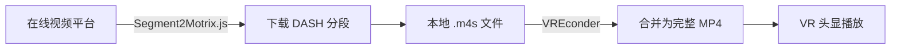

# Segment2Motrix.js 使用指南

## 📌 什么是 Segment2Motrix.js？

Segment2Motrix.js 是一个**浏览器用户脚本**（UserScript），用于从在线视频平台下载 DASH (Dynamic Adaptive Streaming over HTTP) 格式的分段视频文件。

### 核心功能
- 🎬 从支持 DASH 流媒体的网站下载视频分段
- 📦 自动保存 `.m4s` 分段文件和 `init.mp4` 初始化文件
- 🏷️ 使用标准化的文件命名格式（与 VREconder 完美兼容）
- ⚡ 支持批量下载多个视频场景

---

## 🚀 安装步骤

### 1. 安装浏览器扩展管理器

首先需要安装浏览器用户脚本管理器（选择其中一个）：

**Tampermonkey**（推荐）：
- Chrome: [Chrome Web Store](https://chrome.google.com/webstore/detail/tampermonkey/)
- Firefox: [Firefox Add-ons](https://addons.mozilla.org/firefox/addon/tampermonkey/)
- Edge: [Edge Add-ons](https://microsoftedge.microsoft.com/addons/detail/tampermonkey/)

**Violentmonkey**（开源替代）：
- Chrome/Firefox/Edge 均支持

### 2. 安装 Segment2Motrix.js 脚本

1. 打开 Tampermonkey 仪表板
2. 点击 "新建脚本"
3. 粘贴 Segment2Motrix.js 脚本代码
4. 保存脚本（Ctrl+S）

> **注意**：脚本源码通常托管在 Greasy Fork 或 GitHub 上，请从可信来源获取。

### 3. 验证安装

访问支持的视频网站，如果看到下载按钮或菜单，说明安装成功。

---

## 🎯 使用方法

### 基本使用流程

```
1. 访问支持 DASH 流媒体的视频网站
   ↓
2. 播放目标视频
   ↓
3. 点击 Segment2Motrix.js 提供的下载按钮
   ↓
4. 选择下载质量和保存路径
   ↓
5. 等待下载完成
```

### 下载后的文件结构

Segment2Motrix.js 会创建如下的文件夹结构：

```
Video_Title/
├── init.mp4                         # 视频初始化文件（包含编码信息）
├── P1-450.056-792.500-0001.m4s     # 分段文件（段落1，序列1）
├── P1-450.056-792.500-0002.m4s     # 分段文件（段落1，序列2）
├── P2-816.843-958.160-0003.m4s     # 分段文件（段落2，序列3）
└── ...                              # 更多分段
```

**文件命名格式解析**：
```
P{段落号}-{开始时间}-{结束时间}-{序列号}.m4s

示例: P1-450.056-792.500-0001.m4s
- P1: 段落 1
- 450.056: 开始时间（秒）
- 792.500: 结束时间（秒）
- 0001: 序列号
```

---

## 🔗 与 VREconder 配合使用

### 工作流程



### 单个视频合并

```bash
# 合并单个文件夹中的分段
python vreconder.py dash-merge ./Video_Title --output ./Video_Title.mp4
```

**输出示例**：
```
✅ 成功合并: Video_Title.mp4 (234.5 MB, 15.2秒)
```

### 批量视频合并（推荐）

```bash
# 第1步：扫描预览
python vreconder.py dash-merge C:\Users\carll\Desktop\catDownloads\merge --batch --dry-run

# 第2步：批量合并（4个并行任务）
python vreconder.py dash-merge C:\Users\carll\Desktop\catDownloads\merge --batch --workers 4
```

**典型输出**：
```
🎬 VREconder 批量DASH合并
📁 输入目录: C:\Users\carll\Desktop\catDownloads\merge
📁 输出目录: C:\Users\carll\Desktop\catDownloads\merge\merged
🔧 并行任务: 4

🔍 扫描目录...
📁 找到 3 个DASH文件夹:
  1. Video1 (45 m4s + 1 init) | 234.5 MB
  2. Video2 (32 m4s + 1 init) | 187.2 MB
  3. Video3 (120 m4s + 1 init) | 892.7 MB

🚀 开始批量处理...
✅ [1/3] 33.3% | Video1 | 15.2s
✅ [2/3] 66.7% | Video2 | 12.8s
✅ [3/3] 100.0% | Video3 | 45.6s

📊 批量处理完成摘要
✅ 成功: 3 个文件夹 | ❌ 失败: 0 个文件夹 | 📈 成功率: 100.0%
⏱️ 总耗时: 47.3 秒 | 🚀 平均速度: 27.8 MB/s
```

---

## ⚙️ 高级配置

### 下载质量选择

大多数 Segment2Motrix.js 实现支持选择视频质量：
- **4K/2K** - 适合 VR 头显观看
- **1080p** - 平衡质量和文件大小
- **720p** - 快速下载

### 文件保存位置

建议设置统一的下载目录，例如：
```
C:\Users\carll\Desktop\catDownloads\merge\
```

这样可以方便使用 VREconder 批量处理。

---

## ❗ 常见问题

### Q1: 下载失败怎么办？

**检查清单**：
1. ✅ 确认浏览器扩展已启用
2. ✅ 检查浏览器控制台是否有错误信息
3. ✅ 确认网站支持 DASH 流媒体
4. ✅ 尝试刷新页面重新加载脚本

### Q2: 下载的文件不完整？

**可能原因**：
- 网络连接中断
- 浏览器标签页被关闭
- 网站限制了下载速度

**解决方案**：
- 重新下载丢失的分段
- 使用稳定的网络连接
- 保持浏览器标签页打开直到下载完成

### Q3: VREconder 无法识别下载的文件？

**检查文件命名格式**：
```bash
# 正确格式（VREconder 可识别）
P1-450.056-792.500-0001.m4s
init.mp4

# 错误格式
segment_001.m4s
video_init.mp4
```

如果文件命名格式不匹配，需要手动重命名或修改脚本输出格式。

### Q4: 支持哪些视频网站？

Segment2Motrix.js 支持的网站取决于脚本实现，常见支持的平台：
- [平台列表需根据实际脚本补充]

> **隐私提示**：请仅下载您有权访问的内容，尊重版权和使用条款。

---

## 🔧 故障排除

### 浏览器控制台检查

1. 按 `F12` 打开浏览器开发者工具
2. 切换到 "Console" 标签
3. 查看是否有错误信息

**常见错误**：
```javascript
// CORS 错误
Access to fetch at '...' has been blocked by CORS policy

// 网络错误
Failed to fetch: net::ERR_CONNECTION_REFUSED
```

### 脚本调试

在 Tampermonkey 仪表板中：
1. 找到 Segment2Motrix.js 脚本
2. 点击 "编辑"
3. 检查脚本是否有语法错误
4. 确认 `@match` 规则包含目标网站

---

## 📚 相关文档

- [VREconder README](../README.md) - VREconder 项目总览
- [批量 DASH 合并示例](../examples/batch_dash_merge_example.md) - 详细使用示例
- [快速开始指南](QUICKSTART.md) - VREconder 快速上手

---

## 🤝 贡献与反馈

如果您发现文档有误或有改进建议，欢迎：
- 提交 Issue
- 发起 Pull Request
- 分享您的使用经验

---

*最后更新: 2026-01-09*  
*适用于: VREconder v3.0+*
